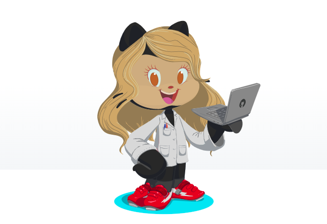

[;Seja+Bem+Vindo+(a)+ao+meu+perfil!)](https://git.io/typing-svg)

 

Sou uma Farmacêutica, Brasiliense em transição de carreira, e atualmente estudo Desenvolvimento web na <a href="https://betrybe.com">Trybe</a></li> em parceria com a <a href="https://www.xpinc.com/">XP Inc.</a></li> 🚀!

### **Sobre mim:**

  

    <li>- 🔭 Atualmente estudo Desenvolvimento Web na <a href="https://betrybe.com">Trybe</a></li>
    <li>- 🤔 Meus hobbies são correr 🏃‍♀️ , viajar(sempre que possível) ✈️🗺️ e estudar(inglês, tecnologia, investimentos...)📚</li>
    <li>- 💬 Vamos bater um papo? Tenho paixão em falar de esportes, viagens e investimentos💰</li>
    <li>- ⚡ Fato interessante: já morei em Caracas(Venezuela) por 2 anos</li>
  

---

  <a href="https://github.com/Kamila-hydalgo/Kamila-hydalgo" title="Kamila's profile">
     
   <a/>
 

 

  

    
    
  

           
  

    

---

### **Linguagens e ferramentas:**  

  
   
   
   
  
  
  
  

---

### **Contato:**

   
  

 

⭐️ Baseado em [Thalles Carneiro](https://github.com/thalles-carneiro) e [Wellington Rodrigues](https://github.com/SrTonn)
  

  
  

